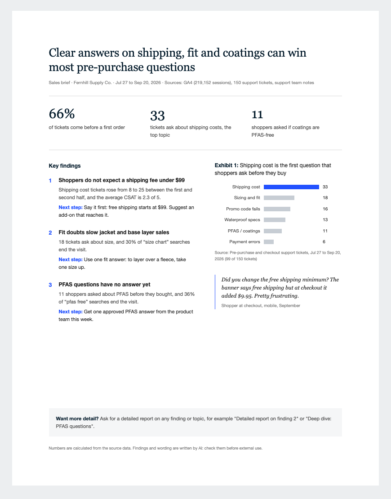

# CX insight to growth

Turn customer feedback and website data into three simple, one-page reports: one for **sales**,
one for **marketing** and one for **product**. Each page shows the 3 most important findings and
the next step for each one. The tool works with Claude, ChatGPT, Gemini or any other AI chat.



More examples: [marketing brief](examples/marketing.png) · [product brief](examples/product.png)

## What you need

- An account with Claude, ChatGPT or Gemini.
- Some customer data. One source is enough to start:
  - **Support tickets** from your help desk (Zendesk, Intercom, Gorgias, Freshdesk and others). An export file, or 30 to 100 tickets copied into the chat.
  - **Website data** from Google Analytics (sessions and purchases by week, channel and device).
  - **Notes from your support team**, as plain text.

If your AI is already connected to these tools, it can get the data itself.

## Set it up (pick your AI)

### Claude (claude.ai)

1. Download [voc-report-skill.zip](downloads/voc-report-skill.zip) (click **Download raw file** on that page).
2. In Claude, open **Settings**, then **Capabilities**. Make sure code execution is on.
3. Under **Skills**, click **Upload skill** and choose the zip file.

### Claude Code

Type these two commands in Claude Code:

```
/plugin marketplace add benfoden/cx-insight-to-growth
/plugin install cx-insight-to-growth@cx-insight-to-growth
```

### ChatGPT (needs a paid plan to make a GPT)

1. Download [chatgpt-gemini-files.zip](downloads/chatgpt-gemini-files.zip) and unzip it.
2. In ChatGPT, open **GPTs**, click **Create**, then open the **Configure** tab.
3. Give it a name, for example "Customer insight briefs".
4. Copy the text in the box below into **Instructions**.
5. Under **Knowledge**, upload all the files from the unzipped folder (including the files in `sample-data`).
6. Under **Capabilities**, turn on **Code Interpreter & Data Analysis** and **Canvas**.
7. Click **Create** and choose who can use it.

### Gemini

1. Download [chatgpt-gemini-files.zip](downloads/chatgpt-gemini-files.zip) and unzip it.
2. In Gemini, open **Gems**, then click **New Gem**.
3. Give it a name, and copy the text in the box below into **Instructions**.
4. Under **Knowledge**, add all the files from the unzipped folder. If Gemini refuses a file, add `.txt` to the end of its name and try again.
5. Click **Save**.

Instructions text for ChatGPT and Gemini:

```text
You make one-page customer insight briefs for sales, marketing and product teams.
Follow voc-report-prompt.md in your knowledge files exactly, step by step.
If you can run Python, run metrics.py on the data.
Use the sample-data files only when the user asks for a demo.
```

### Any other AI (no setup)

1. Open [voc-report-prompt.md](downloads/voc-report-prompt.md) and click **Copy raw file**.
2. Paste it into a new chat.
3. Add your data in the same message, or in the next one.

## Use it

1. Ask: **"Make the customer insight briefs for the last 8 weeks."**
2. Give your data when the AI asks for it. Upload files or paste text.
3. You get three pages: sales, marketing and product. To save a page as a PDF, open it in your browser, click **Print**, then **Save as PDF**.
4. Want more? Ask for detail on any part, for example:
   - "Make a detailed report on finding 2 of the product brief."
   - "Deep dive on shipping costs."

**Try a demo first:** ask "Show me a demo with the sample data." The demo uses a made-up outdoor-gear store.

**Check before you share.** The numbers come from your data, but the AI writes the findings. Read each
page before you send it. Remove names, emails and order numbers from data before you give it to an AI,
and follow your company's rules for customer data.

## For maintainers

```
skills/voc-report/     the skill: SKILL.md (instructions), template.html (page design),
                       metrics.py (optional exact calculator), sample-data/
.claude-plugin/        Claude Code plugin and marketplace files
downloads/             built files for Claude.ai, ChatGPT, Gemini and the copy-paste prompt
examples/              example briefs made from the sample data
scripts/build.py       rebuilds downloads/ after you change the skill
```

After you edit anything in `skills/voc-report/`, run `python3 scripts/build.py` and commit the new `downloads/`.
